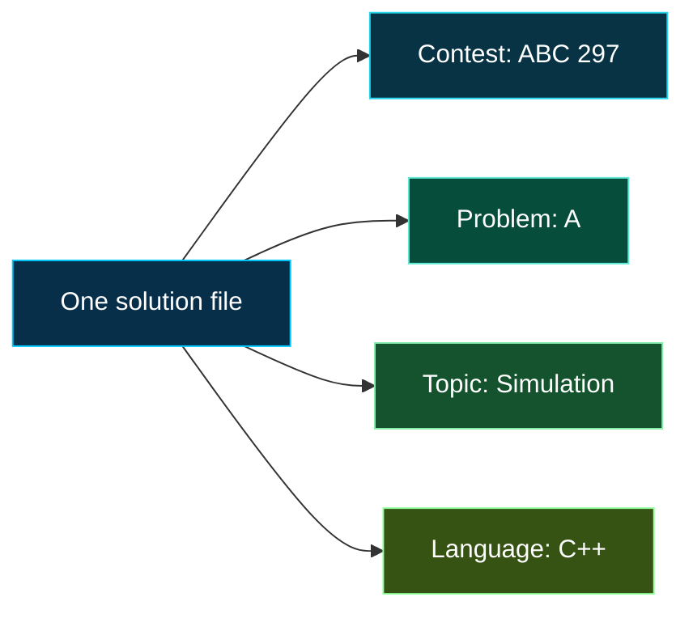

<div align="center">


<br>


<br><br>

A curated collection of AtCoder solutions built for **understanding**, **revision**, and **reuse**.

[Browse ABC](./AtCoder%20Beginner%20Contest%20%28ABC%29/) &nbsp;|&nbsp; [Architecture](#repository-architecture) &nbsp;|&nbsp; [Solution Standard](#solution-standard) &nbsp;|&nbsp; [Toolkit](#toolkit)

</div>

---

## Repository Intent

This repository preserves more than accepted code. Each solution records:

| Pattern | Reasoning | Implementation |
| :---: | :---: | :---: |
| The idea involved | The observation that makes it work | The trade-offs shaping the final code |

Many AtCoder problems combine several techniques at once. A single task might involve **math**, **greedy reasoning**, **binary search**, **graphs**, or **dynamic programming**, while still having one clean implementation.

That leads to the central design rule:

> Store every solution once. Keep it inside its contest folder so it stays easy to find, revisit, and improve.

---

## Browse the Archive

The physical files are organized by contest. Problem names preserve their AtCoder letter and title so the archive stays searchable without needing duplicate folders.

| View | Best used for | Open |
| :--- | :--- | :---: |
| **ABC Contests** | Revisiting AtCoder Beginner Contest problems | [Explore ABC](./AtCoder%20Beginner%20Contest%20%28ABC%29/) |
| **Contest Number** | Finding a specific round quickly | Open the matching `ABC_xxx` folder |
| **Problem Code** | Locating a known task by letter and title | Search for files like `A_Double_Click.cpp` |

For example, `A_Double_Click.cpp` lives under `AtCoder Beginner Contest (ABC)/ABC_297/`, keeping the solution tied to the contest where it appeared.

---

## Repository Architecture

```text
AtCoder-Solutions/
+-- AtCoder Beginner Contest (ABC)/
|   +-- ABC_297/
|   |   +-- A_Double_Click.cpp
|   +-- ...
+-- README.md
```

### Why this structure?

| Decision | Reason |
| :--- | :--- |
| **Store by contest** | Every solution keeps its original AtCoder context |
| **Preserve problem codes** | Letters like `A`, `B`, and `C` make tasks easy to scan |
| **Use stable filenames** | Problem titles remain readable during revision |
| **Avoid duplicate files** | Improvements happen in one place and links stay clean |

Difficulty-first folders are intentionally avoided. AtCoder problems are naturally grouped by contest, and that contest identity is usually the fastest way to rediscover a solution.

---

## Classification Model



The **contest folder** gives the solution its source. The **problem code** keeps it searchable. The **primary insight** explains the main breakthrough.

---

## Solution Standard

Every solution should remain useful after the original contest is no longer fresh.

```cpp
/*
 * Contest: AtCoder Beginner Contest 297
 * Problem: A. Double Click
 * Link: https://atcoder.jp/contests/abc297/tasks/abc297_a
 * Language: C++17
 * Primary insight: Scan adjacent timestamps
 * Topics: Array, Simulation
 * Time: O(n)
 * Space: O(1)
 *
 * Insight:
 * The first adjacent pair with difference <= d forms the answer.
 */
```

| Principle | What it means here |
| :--- | :--- |
| **One canonical solution** | Keep exactly one implementation of each problem |
| **Contest-first organization** | Store solutions where their original round can be found |
| **Reasoning over narration** | Comments explain decisions and observations, not obvious syntax |
| **Explicit complexity** | Time and space costs remain visible during revision |

---

## The Problem-Solving Loop


The goal is not just to pass a task once. It is to understand the observation well enough that the same idea can be recognized again.

---

## Toolkit

<p align="center">
  
</p>

Solutions are written primarily in modern **C++**, with an emphasis on standard-library fluency, explicit complexity, and contest-ready reasoning.

---

## Notes

- Problem statements and examples belong to [AtCoder](https://atcoder.jp/).
- Solutions are personal implementations created for learning and reference.
- Contest folders are navigation layers, not progress trackers.

<div align="center">


</div>
